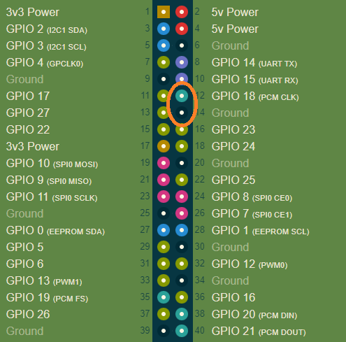

# Python RGB Christmas Tree

This is a repository for my Christmas Tree. Utilizing a Raspberry Pi and a ws281x RGB Light string, we are able to control my Christmas Tree's RGB lights from a React Touch Screen interface.

### To Get Running

1) Install the required libraries ```sudo pip install -r requirements.txt```
    - Requirements must be installed as sudo as the service wil run as sudo
2) On the Raspberry Pi, install <a href="https://pm2.keymetrics.io/">PM2</a> to daemonize the HTTP service
    - You will need to install Node JS prior to pm2
    - You can daemonize it anyway you like, if you don't though the service will be lost on reboot
3) Set and forget the service
    - Set the service to run a boot.
    - Make sure the service runs as sudo, otherwise it will error out as it won't have hardware level access

### A note about security

***If doing this and connecting it online you should understand your network security. I recommend putting the hardware in a VLAN thats firewalled off from the rest of your network or isolating the hardware in your routers DMZ.***


## Hardware
<p>Current hardware is a Raspberry Pi Zero 2. A single JST 2 Pin Socket has been soldered to it to connect the lights securely.</p>


### RGB Lights
This code will work with any ws281x RGB lighting strip thats a single line of LEDs. 


### Pinout

The RBG signal string is connected to pin12 (GPIO 18) to use the PWM Channel for control. If not using a Raspberry Pi 4, you will need to check for a signal channel available on the device you are using.


<p>Image source <a href="https://pinout.xyz/">https://pinout.xyz/</a></p>