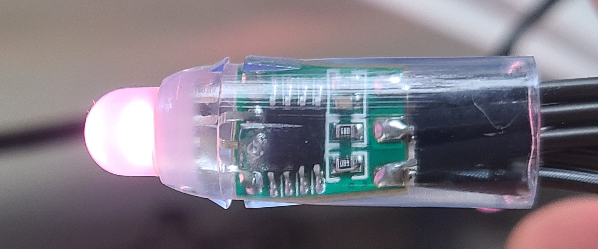

# Alexa Holiday Lights

This is a repository for my holiday light string. Utilizing a Raspberry Pi and a ws281x RGB Light string, we are able to create a voice controlled set of lights.

### To Get Running

1) Create an Alexa Skill in the Alexa Dashboard. 
2) For the skill endpoint, point to an address for the Raspberry Pi
    - I did this using cloudflared tunnel as it allows free DNS tunneling
    - <a href="https://ngrok.com/">ngrok</a> is much faster and easier for development
3) Install the required libraries ```sudo pip install -r requirements.txt```
    - Requirements must be installed as sudo as the service wil run as sudo
4) On the Raspberry Pi, install <a href="https://pm2.keymetrics.io/">PM2</a> to daemonize the alexa service
    - You will need to install Node JS prior to pm2
    - You can daemonize it anyway you like, if you don't though the service will be lost on reboot
5) Set and forget the service
    - Set the service to run a boot.
    - Make sure the service runs as sudo, otherwise it will error out as it won't have hardware level access

### A note about security

***If doing this you should understand your network security. I recommend putting the hardware in a VLAN thats firewalled off from the rest of your network or isolating the hardware in your routers DMZ.***

### Current Skills

<table>
    <tr>
        <th>Invocation Phrases</th>
        <th>Intent in Alexa Dash</th>
        <th>Loop Function</th>
        <th>Function Called / kwargs</th>
    </tr>
    <tr>
        <td>turn off lights</td>
        <td>turnOffIntent</td>    
        <td>No</td>    
        <td>light_string.setSolid, {"color": LedColor.black}</td>
    </tr>
    <tr>
        <td>Start Rainbow Chase</td>
        <td>setRainbowChaseIntent</td>
        <td>Yes</td>    
        <td>light_string.rainbowCycle</td>
    </tr>
    <tr>
        <td>start slow color changing</td>
        <td>slowRandomTransitionIntent</td>    
        <td>Yes</td>    
        <td>
            light_string.transition_to_random_color, {"wait_after_transition_ms": 1}
        </td>
    </tr>
    <tr>
        <td>solid random colors</td>
        <td>solidRandomIntent</td>    
        <td>No</td>    
        <td>light_string.random_colors</td>
    </tr>
</table>

## Hardware
<p>Current hardware is a Raspberry Pi 4 running off an NVMe SSD on USB3.0 for rapid prototyping. However once development is complete it will likely be moved to Raspberry Pi Zero W or other inexpensive SBC.</p>


### RGB Lights
This code will work with any ws281x RGB lighting strip thats a single line of LEDs. 



### Pinout

The RBG signal string is connected to pin12 (GPIO 18) to use the PWM Channel for control. If not using a Raspberry Pi 4, you will need to check for a signal channel available on the device you are using.


<p>Image source <a href="https://pinout.xyz/">https://pinout.xyz/</a></p>